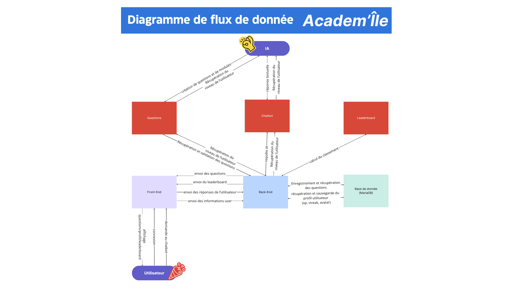
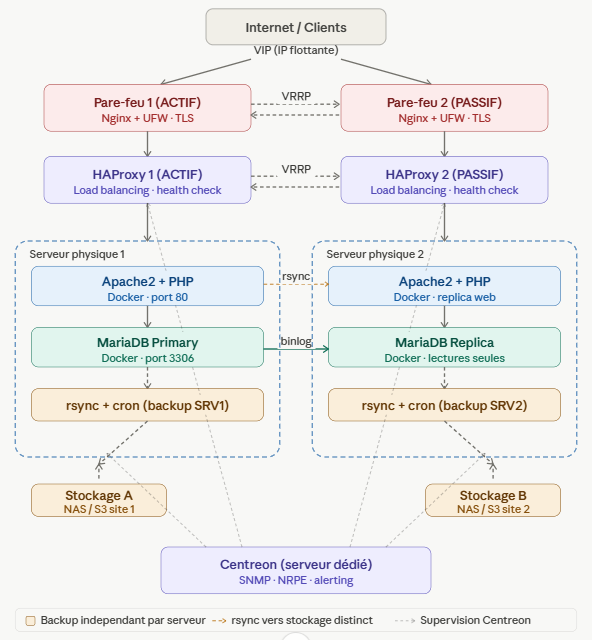

# ACADEM'ÎLE - Hackathon Expernet 2026

Plateforme EdTech gamifiée qui utilise l'IA pour personnaliser les parcours de formation selon les besoins, les objectifs et le rythme de chaque apprenant.

> COMMENT L'IA ET LA GAMIFICATION VONT-ELLES RÉVOLUTIONNER LA FORMATION ?

## Membres de l'équipe

| Nom | Rôle |
| --- | ---- |
| Marielle AGATHE | Marketing Digital |
| Anne LEBEAU | CDA |
| Nassim ALI MAHOMED | Marketing Digital |
| Jérôme CADERBY | ESD |
| Matthias CLAIN | ASR |
| Anthony DÉGEILH | CDA |
| Lucas DIJOUX | ASR |
| Lucas JULIEN | DPI |
| Théo KASPROWICZ | ESD |
| Damien PAYET | ASR |

## Stack technique

| Couche | Technologie |
| ------ | ----------- |
| Frontend | Twig + Tailwind CSS v4 + Stimulus (Symfony UX) |
| Backend | Symfony 8 (PHP 8.4+) |
| Base de données | MariaDB 11 (Doctrine ORM 3) |
| IA | Mistral AI (`mistral-small-latest`) |
| Gamification | XP, niveaux, badges |
| API doc | NelmioApiDocBundle v5 (Swagger UI — `/api/doc`) |

## Prérequis

- [Docker Desktop](https://www.docker.com/products/docker-desktop/) (inclut Docker Compose)
- `make` — voir ci-dessous selon l'OS
- Une clé API Mistral AI (gratuite sur [console.mistral.ai](https://console.mistral.ai))

> **PHP, Composer et MariaDB ne sont pas requis en local** — tout s'exécute dans les conteneurs Docker.

### Installer `make`

| OS | Méthode |
| -- | ------- |
| **macOS** | Pré-installé avec Xcode CLT (`xcode-select --install`) |
| **Linux** | `sudo apt install make` (Debian/Ubuntu) |
| **Windows** | Utiliser **WSL 2** (recommandé) ou **Git Bash** + `choco install make` |

> **Windows sans WSL** : les commandes `make` peuvent aussi être remplacées par leurs équivalents `docker compose` listés dans le [Makefile](Makefile).

## Installation

> **Variables d'environnement** — le fichier `.env` n'est pas versionné (repo public).
> Copier `.env.example` vers `.env` et renseigner les variables suivantes auprès du référent technique de l'équipe (canal privé) :
>
> | Variable | Description |
> | -------- | ----------- |
> | `APP_SECRET` | Clé secrète Symfony — générer avec `php bin/console secret:generate-tokens` |
> | `DATABASE_URL` | Déjà configurée pour Docker (`db`) ; remplacer `db` par `127.0.0.1` en dev local |
> | `MARIADB_ROOT_PASSWORD` | Mot de passe root MariaDB (Docker uniquement) |
> | `MARIADB_USER` | Utilisateur MariaDB — doit correspondre à `DATABASE_URL` |
> | `MARIADB_PASSWORD` | Mot de passe MariaDB — doit correspondre à `DATABASE_URL` |
> | `MISTRAL_API_KEY` | Clé API Mistral — à demander au référent |

### Via Docker (recommandé)

> **Windows** : lancer les commandes depuis **WSL 2** ou **Git Bash**, pas depuis PowerShell/CMD.

```bash
# 1. Cloner le dépôt
git clone https://github.com/IAmArayel/Hackathon_Expernet_2026.git
cd Hackathon_Expernet_2026

# 2. Configurer l'environnement
cp .env.example .env
# Renseigner toutes les variables dans .env

# 3. Installation complète en une commande
make install

# (Optionnel) Charger les données de développement
make fixtures
```

| Commande | Description |
| -------- | ----------- |
| `make start` | Démarrer les conteneurs |
| `make stop` | Arrêter les conteneurs |
| `make reset` | Tout supprimer et reconstruire (**⚠ efface la BDD**) |
| `make migrate` | Appliquer les migrations |
| `make fixtures` | Charger les données de dev (**⚠ vide la BDD**) |
| `make tailwind` | Compiler les assets Tailwind |
| `make cc` | Vider le cache Symfony |
| `make sh` | Shell dans le conteneur PHP |
| `make db-sh` | Shell MariaDB |
| `make logs` | Logs en temps réel |
| `make help` | Lister toutes les commandes |

L'application est accessible sur <http://localhost:8080>.
Documentation API (Swagger) : <http://localhost:8080/api/doc>

### En local (sans Docker)

```bash
# 1. Cloner le dépôt
git clone https://github.com/IAmArayel/Hackathon_Expernet_2026.git
cd Hackathon_Expernet_2026

# 2. Installer les dépendances
composer install

# 3. Configurer l'environnement
cp .env.example .env
# Adapter DATABASE_URL (remplacer "db" par "127.0.0.1"), renseigner APP_SECRET et MISTRAL_API_KEY

# 4. Générer un APP_SECRET
php bin/console secret:generate-tokens

# 5. Initialiser la base de données
php bin/console doctrine:database:create
php bin/console doctrine:migrations:migrate

# 6. Lancer le serveur
symfony server:start
php bin/console tailwind:build --watch
```

L'application est accessible sur https://localhost:8000.
Documentation API (Swagger) : <https://localhost:8000/api/doc>

## Architecture

### Flux de données

#### Composants

| Composant | Rôle |
| --------- | ---- |
| **Utilisateur** | Point d'entrée : connexion, navigation (questions / profil / leaderboard), demandes au chatbot |
| **Front-End** | Interface web - affiche questions, leaderboard, réponses et informations utilisateur |
| **Back-End** | Orchestrateur central - reçoit les actions utilisateur, pilote l'IA et persiste les données |
| **IA** | Génère questions et modules, fournit les réponses textuelles du chatbot selon le niveau de l'utilisateur |
| **Questions** | Module de gestion des questions - récupération et validation depuis le Back-End |
| **Chatbot** | Interface conversationnelle - envoie les requêtes IA et récupère le niveau de l'utilisateur |
| **Leaderboard** | Calcule et affiche le classement des apprenants |
| **Base de données** | Persistance : enregistrement/récupération des questions, sauvegarde du profil utilisateur (XP, streak, avatar) |

#### Flux principaux

| Source | Destination | Données échangées |
| ------ | ----------- | ----------------- |
| Utilisateur | Front-End | Connexion, navigation (questions / profil / leaderboard), demandes au chatbot |
| Front-End | Back-End | Réponses de l'utilisateur, informations user |
| Back-End | Front-End | Questions, leaderboard, réponses, informations user |
| Back-End | IA | Niveau de l'utilisateur, requête de génération |
| IA | Questions | Création de questions et de modules |
| IA | Chatbot | Réponse textuelle, niveau de l'utilisateur |
| Chatbot | Back-End | Requête IA, niveau de l'utilisateur |
| Questions | Back-End | Récupération et validation des questions |
| Leaderboard | Back-End | Calcul du classement |
| Back-End | Base de données | Enregistrement/récupération des questions, sauvegarde du profil utilisateur (XP, streak, avatar) |



[(Voir le schéma sur Canva)](https://canva.link/caeq8t7qaa2wor0)

### Architecture réseau

#### Couches de l'infrastructure

| Couche | Composant | Détails |
| ------ | --------- | ------- |
| **Entrée** | Internet / Clients | VIP (IP flottante) |
| **Pare-feu** | Pare-feu 1 - ACTIF | Nginx + UFW + TLS |
| | Pare-feu 2 - PASSIF | Nginx + UFW + TLS (bascule VRRP) |
| **Load balancing** | HAProxy 1 - ACTIF | Load balancing + health check |
| | HAProxy 2 - PASSIF | Load balancing + health check (bascule VRRP) |
| **Serveur physique 1** | Apache2 + PHP | Docker · port 80 |
| | MariaDB Primary | Docker · port 3306 |
| | rsync + cron | Backup SRV1 → Stockage A |
| **Serveur physique 2** | Apache2 + PHP | Docker · replica web (sync rsync) |
| | MariaDB Replica | Docker · lectures seules (sync binlog) |
| | rsync + cron | Backup SRV2 → Stockage B |
| **Stockage** | Stockage A | NAS / S3 site 1 |
| | Stockage B | NAS / S3 site 2 |
| **Supervision** | Centreon | Serveur dédié · SNMP + NRPE + alerting |

#### Mécanismes de redondance

- **VRRP** entre les deux pare-feux et les deux HAProxy pour la bascule automatique en cas de panne
- **rsync** entre les deux serveurs physiques pour la synchronisation des fichiers web
- **Réplication MariaDB** (binlog) du Primary vers le Replica en lecture seule
- **Backups indépendants** par serveur vers des stockages distincts (Stockage A et B)



## Gestion du projet

### Conventions de branche

Format : **`<type>-<numéro-issue>(-<description>)`**

| Type | Usage |
| ---- | ----- |
| `feature` | Nouvelle fonctionnalité |
| `bugfix` | Correction non urgente |
| `hotfix` | Correction urgente en production |
| `security` | Correction de faille de sécurité |
| `test` | Ajout ou modification de tests |
| `refactor` | Restructuration interne |
| `chore` | Maintenance / outillage |

### Conventions de commit

Messages en français, suivant la spécification [Conventional Commits](https://www.conventionalcommits.org/fr/v1.0.0/#summary).

```text
feat: ajouter l'authentification JWT
fix: corriger le calcul des points XP
docs: mettre à jour le README
```

### Règles de contribution

- 1 carte GitHub Project = 1 branche = 1 Pull Request
- **1 review obligatoire** avant tout merge sur `main` pour valider les modifications apportées
- Carte GitHub Project complétée d'après le template fourni
